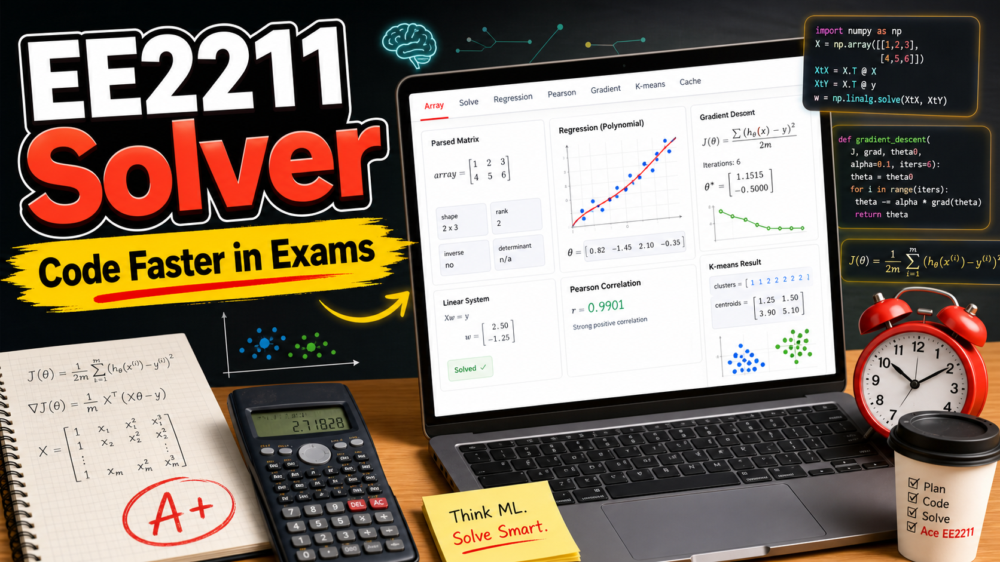

# EE2211 Solver

[](https://youtu.be/58JrtpwjFVY)
(click the image to watch the [demo video](https://youtu.be/58JrtpwjFVY), or try webui app [on streamlit](https://nus-ee2211-solver-hy.streamlit.app/))

EE2211 Solver is a small helper app I made for working through EE2211 (Introduction to Machine Learning) from NUS (National University of Singapore) machine learning calculation questions.

The goal is like:
let the app handle repeated matrix / regression / gradient / tree / clustering
calculation steps, so you can spend more exam time thinking about conceptual questions.

The main way to use it is the Streamlit WebUI. There is also a terminal menu if
you prefer command line tools.

## What It Can Do

- Parse matrices and quickly check shape, rank, transpose, inverse, left inverse,
  and right inverse.
- Solve linear systems such as `Xw = y` and `wX = y`.
- Fit linear, polynomial, ridge, and ridge-polynomial regression models.
- Run one-hot linear / polynomial classification workflows.
- Calculate Pearson correlation for one or more columns.
- Step through symbolic gradient descent with iteration history.
- Compute decision-tree impurity with Gini, entropy, and classification error.
- Check one-level regression-tree splits and find the best threshold.
- Run K-means clustering from points and initial centroids.
- Cache matrices and results in the WebUI so you can copy and reuse them.

## Beginner Setup

You do not need to be good at Python to run this.

The easiest option is to use the hosted WebUI:
[nus-ee2211-solver-hy.streamlit.app](https://nus-ee2211-solver-hy.streamlit.app/)

If you want to run it on your own computer offline, the simplest local setup is:

1. install Python;
2. clone this repo;
3. install the dependencies;
4. start Streamlit.

Virtual environments and `uv` are both optional. They are useful if you already
use them, but you can skip them at first.

### 0. Install Python

Install Python 3.11 or newer from
[python.org](https://www.python.org/downloads/).

After installing, check that Python works:

```bash
python --version
```

If that command does not work on macOS or Linux, try:

```bash
python3 --version
```

On Windows, try:

```powershell
py --version
```

### 1. Clone This Repo

```bash
git clone https://github.com/hykzr/ee2211-solver.git
cd ee2211-solver
```

### 2. Install The App Dependencies

Run this from inside the `ee2211-solver` folder:

```bash
python -m pip install -e .
```

If you used `python3` or `py` when checking your Python version, use the same
command here:

```bash
python3 -m pip install -e .
```

```powershell
py -m pip install -e .
```

This may take a little while the first time. It installs the Python packages the solver needs.

If Python says the environment is externally managed, use the optional virtual environment setup below, then run the install command again.

### 3. Start The WebUI

Run:

```bash
python -m streamlit run webui.py
```

Again, if you used `python3` or `py` above, use that instead:

```bash
python3 -m streamlit run webui.py
```

```powershell
py -m streamlit run webui.py
```

Streamlit will print a local link, usually something like:

```text
2026-06-26 23:28:29.624 Uvicorn server started on 0.0.0.0:8501

  You can now view your Streamlit app in your browser.

  Local URL: http://localhost:8501
  Network URL: http://...:8501
  
  For better performance, install the Watchdog module:
  ...
```

Open that link after `Local URL:` in your browser (for the example above, the link to copy is `http://localhost:8501`). It may take some seconds for the web page to load

### Optional: Use A Virtual Environment

A virtual environment keeps this app's Python packages separate from your other
Python projects. You do not need one just to try the solver, but it is a tidy
habit if you install a lot of Python tools.

On macOS or Linux, run:

```bash
python -m venv .venv
source .venv/bin/activate
```

If `python` does not work, use `python3` instead:

```bash
python3 -m venv .venv
source .venv/bin/activate
```

On Windows PowerShell, run:

```powershell
py -m venv .venv
.venv\Scripts\Activate.ps1
```

After activation, your terminal prompt may show `(.venv)`.

Then go back to step 2 and install the dependencies.

### Optional: Use `uv` Instead

If you already have `uv`, you can let it manage setup for you:

```bash
uv sync
uv run streamlit run webui.py
```

If you do not have `uv` and want to try it, see the
[uv installation guide](https://docs.astral.sh/uv/getting-started/installation/).

## How To Type Matrices

Most input boxes accept simple rows like this:

```text
1 2
3 4
```

You can also use semicolons:

```text
1 2; 3 4
```

Or Python-style arrays:

```text
[[1, 2], [3, 4]]
```

For long one-dimensional data, a useful trick is to type it sideways first:

```text
0 1 2 3 4 5
```

Then click the `Transpose` button to turn it into a column.

## Cache Tip

The WebUI saves recent inputs and results in the `Cache` tab. This is useful
when you want to copy a model matrix, a weight vector, predictions, centroids,
or any intermediate result and paste it into another tab.

The app stores temporary WebUI state and cached matrices under `temp/`. That
folder is ignored by Git.

## Optional: Terminal Version

If you prefer a text menu instead of the browser app, run this from the repo
folder after installing the dependencies:

```bash
python main.py
```

If you used `python3` or `py` during setup, use that instead.
With `uv`, run `uv run python main.py` instead.

You can choose menu items by number, or use shortcuts like `linear`, `ridge`,
`pearson`, `gradient`, `impurity`, and `split`.

## Run Tests

If you want to check that the solver logic is still working:

```bash
python run_tests.py
```

If you used `python3` or `py` during setup, use that instead.
With `uv`, run `uv run python run_tests.py` instead.

## Exam Rules And Academic Integrity

Please check the current EE2211 exam rules before using this in any exam.
For my year, pre-written offline code / offline materials were allowed for the
open-book Examplify exams, as long as they followed the stated restrictions.
That does **not** automatically mean the same rules apply every year. The
teaching team can change the policy, and your exam instructions are the source
of truth.

Before relying on this solver in an exam, confirm things like:

- whether pre-coded scripts are allowed;
- whether using code from others (e.g. from a public repository) is allowed.

The solver itself, although coded partially by llm, does not need internet access, nor does it use any local llm based tools.

Use the repo responsibly. It is a study and calculation helper, not permission
to ignore course or exam rules.

## License

This project is released under the MIT License. See [LICENSE](LICENSE).

That means you can use, modify, and share it, but it is provided as-is with no
warranty. The authors are not responsible for misuse, wrong answers, rule
violations, or any consequences from using it in a setting where it is not
allowed.
